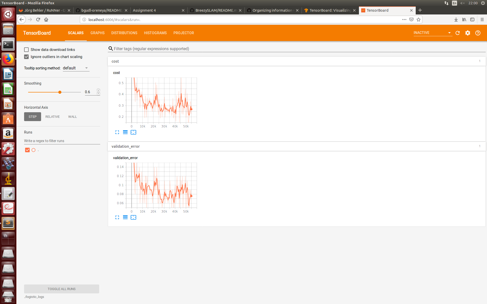
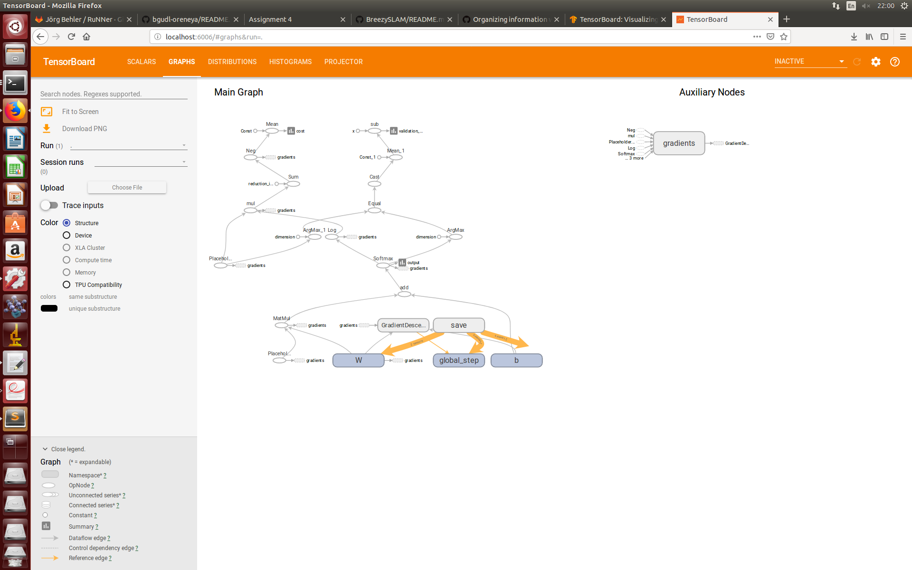

# Summary of results

## TensorBoard output

## Test accuracies
* Logistic regression with 100 epochs:                                   0.9222
* Original (two hidden layers) multilayer perceptron with 1000 epochs:   0.8834
* Original (two hidden layers) multilayer perceptron with 100 epochs:    0.9219 (avg.)
* Modified (one hidden layer) multilayer perceptron with 100 epochs:     0.9538 (avg.)

## Disscussion

### 1. Did running many more (1,000 vs 100) epochs yield better or worse results for the original multilayer perceptron?

The answer varies from run to run. 4 of them were 0.97xx, while another one got only 0.6966. This is too high of a variability and too few shots to conclude from.

### 2. Did the multilayer pereceptron do better or worse than logistic regression when you ran them both for 100 epochs?

Compared to the result of one training session of logistic-regression, MLP did better with 4 out of 5 runs. On average though they performed the same.

### 3. Did decreasing the number of hidden layers reduce the success of the multilayer perceptron?

No. Comparing the averages, the 1 hidden layer MLP got a better result. BUT, if neglecting the one outlier from both MLP's, the results are quite the same at 0.97xx.

### 4. What general lesson might you deduce from your answers to these three questions?

In some cases, the MLP / NN architecture might have a smaller impact than initialization.  

